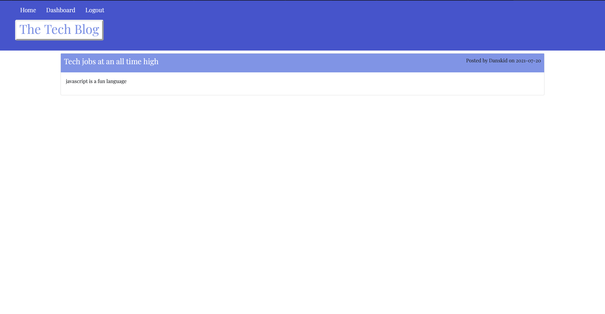

# Tech Blog

## Table of Contents
* [Description](#description)
* [Installation](#installation)
* [Usage](#usage)
* [Languages Used](#languages_used)
* [Dependencies Used](#dependencies_used)
* [Deployed Links](#deployed-links)
* [License](#license)
* [User Story](#user-story)
* [Mockup](#mockup)

## Description
  This application is designed to allow posting, creating, deleting and updating of user blogs. A user logs in with their account then able to see blogs made during their session.
## Installation
  In other to install this application you need to start by creating the database and running the seed files in the `seed.js` file. Then, you can run npm start in your terminal.
## Usage
  To use the application, you should start by installing all dependencies in the `package.json` file then start your server.
## Languages Used
* Sql
* Express.js
* Sequelize
* Handlebars
## Dependencies Used
* bcrypt
* connect-session-sequelize
* dotenv
* express
* express-handlebars
* express-session
* mysql2
* sequelize
## Deployed Links
* [Heroku app](https://quiet-ridge-20964.herokuapp.com)
* [Github Repository](https://github.com/Daniel-ipymb/tech_blog)

## License
[MIT License](https://choosealicense.com/licenses/mit/)

## User Story
```md
AS A developer
I WANT an application i can log in and save my blogs
I WANT to create, edit and update my blog and also delete unwanted blogs
```

## Mockup

